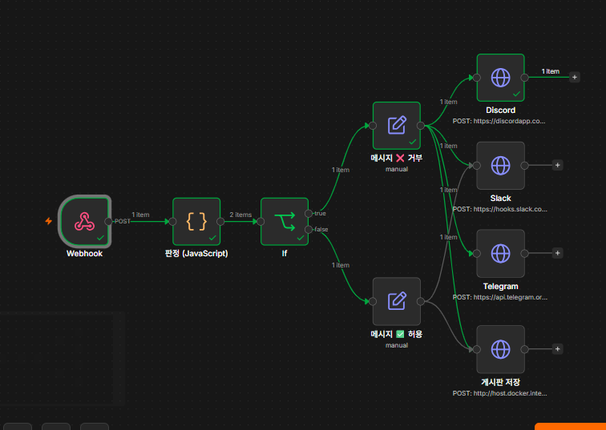
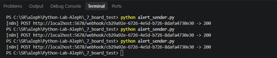
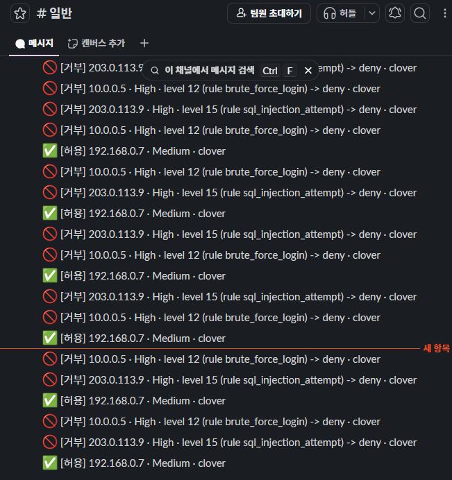
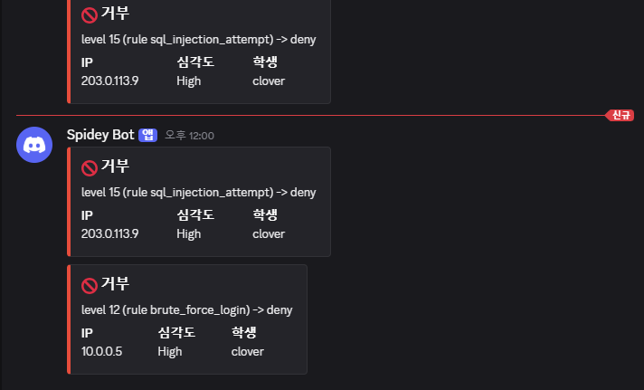
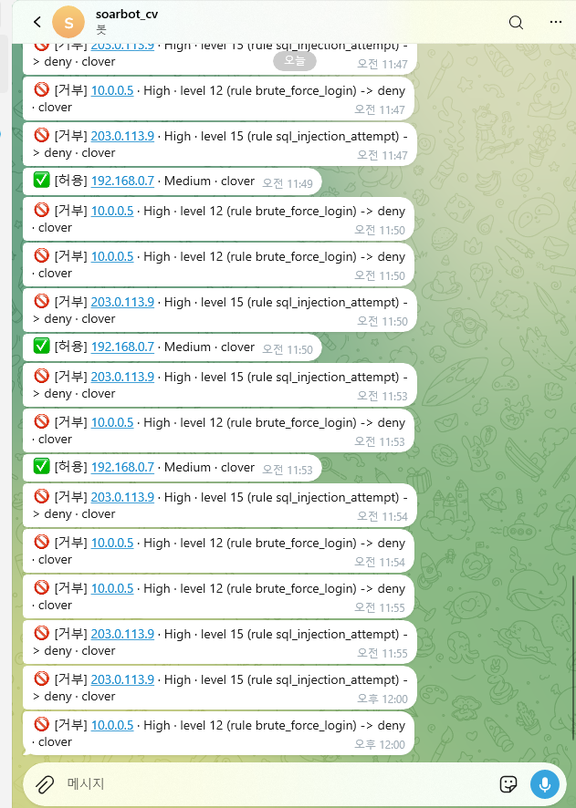
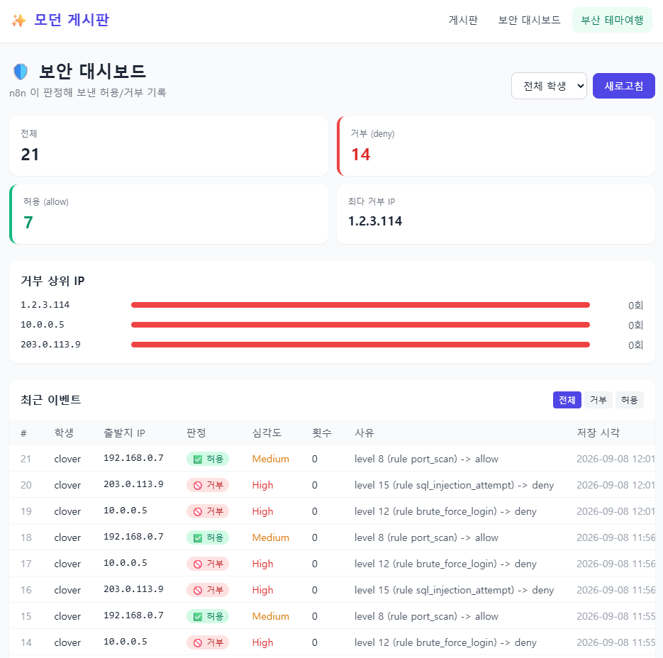
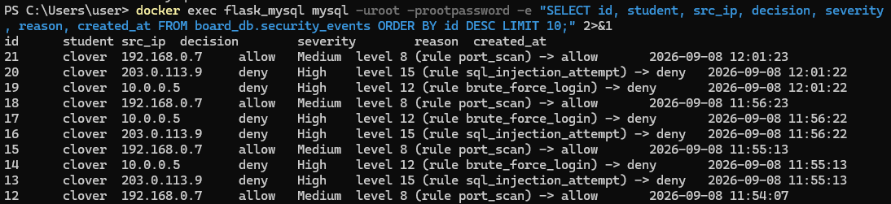
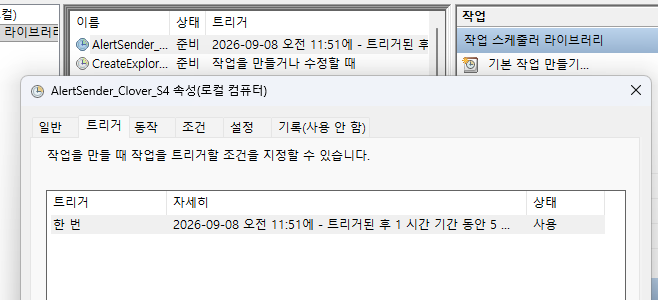

# 로그인 경보 자동화 봇

## ① 무엇을 만들었는지

파이썬 스크립트가 로그인 실패 경보를 만들어 n8n Webhook 으로 보내면, n8n 이 레벨을 보고 허용/거부를 판정해 슬랙·디스코드·텔레그램에 알림을 보내고, 게시판(Flask + MySQL) REST API 에 판정 결과를 저장한다. 마지막엔 Windows 작업 스케줄러로 5분마다 자동 실행되도록 구성했다.

## ② 작업 내역

**사용한 것**: Python(Flask, SQLAlchemy, requests) · n8n(Docker) · MySQL(Docker) · 슬랙/디스코드/텔레그램 · Windows 작업 스케줄러

**만든 순서**

1. `alert_sender.py` — 경보(ip·level·rule) 목록을 만들어 n8n Webhook 으로 POST
2. n8n Code 노드(JavaScript) — level 기준으로 severity·decision 판정 (`level≥10→High/deny`, `level≥7→Medium/allow`, 그 외 `Low/allow`), 거부 기준을 상수로 분리
3. n8n If 노드 — `decision`이 `deny`인지로 분기
4. 분기별 메시지 노드(Edit Fields) — 거부는 `🚫`, 허용은 `✅`로 시작하는 문구 생성, 원본 필드(`src_ip` 등)는 `Include Other Input Fields`로 보존
5. 슬랙·디스코드·텔레그램 HTTP 노드로 알림 전송, 게시판 REST API(`POST /api/security/events`)로 DB 저장까지 연결
6. 게시판(Flask) 쪽에 이미 구현돼 있던 `/api/security/events` API(X-API-Key 인증, 401/400/201 처리)와 `/dashboard` 화면으로 결과 확인
7. (심화) `/api/security/events/summary` 로 통계 조회, 허용은 슬랙에만 보내도록 분기 축소, 디스코드는 색깔 있는 embed 카드로 전송, Windows 작업 스케줄러로 5분마다 자동 실행

## ③ 기능 구현 화면

> 아래 이미지는 `images/` 폴더에 추가해서 채워 넣을 것

## ④ 실행 방법

① **켜는 것**: Docker Desktop 실행 → MySQL·n8n 컨테이너 기동(`docker ps`로 확인) → `_7_board_test`(원본 저장소 기준)에서 `.env` 준비 후 `python app.py`로 게시판 서버 실행 → n8n 워크플로우 **Active** 켜기

② **실행하는 것**: 터미널에서 `python alert_sender.py` (사전에 `.env` 또는 코드 상수에 본인 n8n Webhook URL 채워야 함)

③ **통과 화면**: 터미널에 `[n8n] POST ... -> 200` 출력 → 슬랙/디스코드/텔레그램에 거부·허용 알림 도착 → `http://localhost:5000/dashboard`에서 방금 기록이 표에 보임

④ **안 될 때 보는 곳**: n8n **Executions** 탭에서 어느 노드가 빨간불인지 확인 → 게시판 저장이 400이면 메시지 노드의 `Include Other Input Fields`가 꺼져 있지 않은지, 401이면 `X-API-Key` 헤더 값이 `.env`의 `SECURITY_API_KEY`와 같은지 확인

## ⑤ 막혔던 점과 해결 방법

1. **n8n Code 노드에서 Python 선택 시 `Python runner unavailable: Python 3 is missing from this system`** — 이 n8n(Docker) 컨테이너엔 내장 Python 런타임이 없어서 Python 모드는 디버깅 전용으로만 동작하고, 실제 실행은 별도 external 러너가 필요했다. 로직을 JavaScript로 그대로 옮겨서 해결(특수 변수만 `_input` → `$input`으로 변경).
2. **게시판 저장 노드가 계속 `Bad request`** — HTTP Request 노드의 Headers를 "Using JSON" 모드로 두고 값(API 키)만 텍스트로 넣어서 JSON 문법 자체가 깨져 있었다. "Using Fields Below"로 바꿔 Name/Value로 넣어 해결.
3. **PowerShell에서 `curl -H ... -d ...`가 안 먹음** — PowerShell의 `curl`은 `Invoke-WebRequest` 별칭이라 bash 문법을 못 받는다. `curl.exe`로 명시하거나 `Invoke-RestMethod`를 써서 해결.

## AI 활용 구분

- **AI 에게 맡긴 일**: n8n 노드 설정값(Code 노드 로직, IF 조건, HTTP Request 바디/헤더 형식) 초안 작성, 에러 메시지 해석
- **내가 직접 판단한 일**: 어떤 메신저를 실제로 연결할지, 판정 기준값(`DENY_LEVEL`), 심화 항목 중 어떤 걸 할지
- **AI 제안을 그대로 따르지 않은 일**: (해당 시 작성)
